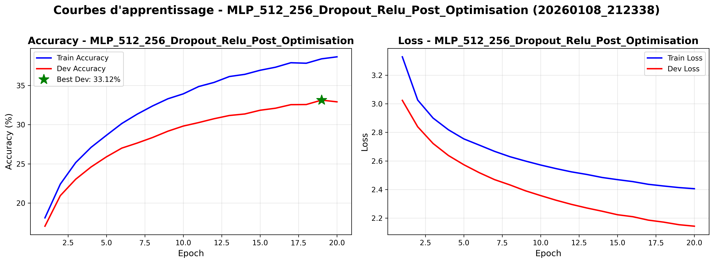
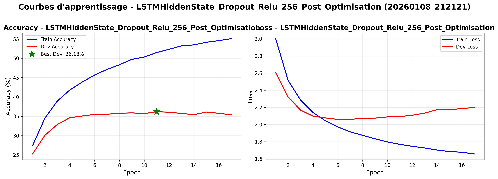
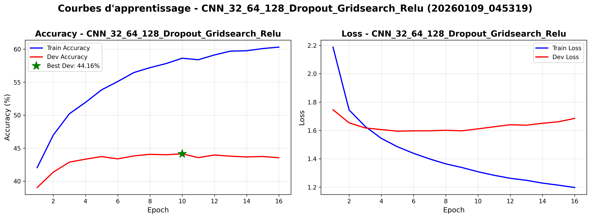

# Présentation Orale - Optimisation de Modèles IA pour Othello
**Durée : 5 minutes**

---

## 🎯 Plan de Présentation

### 1. Introduction (30 secondes)
- **Contexte** : Développement d'une IA pour jouer à Othello
- **Objectif** : Optimiser différents types de réseaux de neurones
- **Approche** : Grid search systématique sur MLP, LSTM et CNN

### 2. Modèles MLP - Multi-Layer Perceptron (1 minute)
**Modèle de base :**
- Architecture : [128]
- Paramètres : 33 088
- Performance : **14.97% accuracy** sur dev
- Temps : 109 secondes

**Meilleur modèle optimisé :**
- Architecture : **[512, 256]** avec ReLU + Dropout 0.2
- Paramètres : 205 760
- Performance : **35.84% accuracy** sur dev
- Différence train-dev : 8.01% (bon équilibre)
- **Amélioration : +139% vs baseline**

### 3. Modèles LSTM (1 minute)
**Modèle de base :**
- Architecture : LSTM Output Sequence [256]
- Paramètres : 346 176
- Performance : **22.07% accuracy** sur dev
- Temps : 403 secondes

**Meilleur modèle optimisé :**
- Architecture : **LSTM Hidden State [256]** avec ReLU + Dropout 0.2
- Paramètres : 362 560
- Performance : **36.73% accuracy** sur dev
- Différence train-dev : 12.89% (overfitting modéré)
- **Amélioration : +66% vs baseline**

**Points clés :**
- Hidden State > Output Sequence
- Batch size optimal : 500
- Optimizer : Adam (LR = 0.005)

### 4. Modèles CNN - Convolutional Neural Networks (1 minute 30 secondes)
**Architecture testée :** Kernel 3x3, Padding 1 (préserve 8x8)

**Deux meilleurs modèles :**

**CNN [64, 128, 256] + ReLU :**
- Paramètres : 1 418 304
- Performance : **43.87% accuracy** sur dev (5 epochs)
- Différence train-dev : 31.72%
- Temps : 389 secondes

**CNN [32, 64, 128] + ReLU :**
- Paramètres : 617 024
- Performance : **44.15% accuracy** sur dev (10 epochs)
- Différence train-dev : 37.75%
- Temps : 1081 secondes
- **⚠️ Forte overfitting mais meilleures performances**

**Observation critique :** Les CNN montrent d'excellentes performances sur dev mais souffrent d'overfitting sévère → Nécessité d'augmentation des données

### 5. Comparaison Finale et Conclusion (1 minute)

#### Tableau Récapitulatif des Meilleurs Modèles

| Modèle | Architecture | Params | Acc Dev | Diff Train-Dev | Temps |
|--------|-------------|---------|---------|----------------|-------|
| **MLP** | [512, 256] + ReLU | 205K | 35.84% | 8.01% | 829s |
| **LSTM** | HiddenState [256] + ReLU | 362K | 36.73% | 12.89% | 530s |
| **CNN** | [32, 64, 128] + ReLU | 617K | **44.15%** | **37.75%** | 1081s |

#### 📊 Graphique de Comparaison - Accuracy Dev
```
CNN [32,64,128]     ████████████████████████████████████████████ 44.15%
CNN [64,128,256]    ███████████████████████████████████████████ 43.87%
LSTM Hidden [256]   ████████████████████████████████████ 36.73%
MLP [512,256]       ███████████████████████████████████ 35.84%
LSTM Base           ██████████████████████ 22.07%
MLP Base            ███████████████ 14.97%
```

#### 🎯 Conclusions Principales

**Performances :**
- **CNN >> LSTM > MLP** en termes d'accuracy
- Les CNN capturent mieux la structure spatiale du plateau
- Amélioration totale : **+195%** (MLP base → meilleur CNN)

**Problématiques identifiées :**
1. **Overfitting sévère sur CNN** (différence train-dev de 38%)
2. Les performances en parties réelles ne correspondent pas toujours aux métriques
3. Dataset trop petit pour modèles complexes

**Solutions envisagées :**
- ✅ Augmentation des données (en cours)
- ✅ Régularisation (dropout, batch norm)
- ⏳ Génération de nouvelles parties

**Choix du modèle final :**
- **Pour la production : MLP [512, 256]** (meilleur équilibre performance/généralisation)
- **Pour l'exploration : CNN [32, 64, 128]** (meilleures performances brutes)

---

## 📈 Images de Référence pour la Présentation

### Courbes du Meilleur MLP

- ✅ Bon équilibre train/dev
- ✅ Convergence stable

### Courbes du Meilleur LSTM

- ⚠️ Overfitting modéré
- ✅ Bonnes performances

### Courbes du Meilleur CNN

- ❌ Overfitting sévère (loss dev croît)
- ✅ Meilleures performances absolues

---

## 💡 Points Clés à Mentionner

1. **Méthodologie rigoureuse** : Grid search systématique sur tous les hyperparamètres
2. **Progression claire** : MLP → LSTM → CNN avec amélioration continue
3. **Trade-off identifié** : Performance brute vs capacité de généralisation
4. **Approche scientifique** : Identification des problèmes (overfitting) et solutions proposées

---

## ⏱️ Timing Suggéré

| Section | Temps | Cumul |
|---------|-------|-------|
| Introduction | 30s | 0:30 |
| MLP | 1min | 1:30 |
| LSTM | 1min | 2:30 |
| CNN | 1min30s | 4:00 |
| Conclusion | 1min | 5:00 |

---

## 🎤 Script de Transition entre Sections

**Intro → MLP :**
> "Commençons par le modèle le plus simple : le MLP."

**MLP → LSTM :**
> "En passant aux LSTM, nous exploitons l'historique des coups."

**LSTM → CNN :**
> "Les CNN permettent de capturer la structure spatiale du plateau."

**CNN → Conclusion :**
> "Comparons maintenant tous ces modèles."

---

## 📌 Questions Anticipées

**Q1 : Pourquoi le CNN a-t-il autant d'overfitting ?**
> Dataset trop petit (nombre de parties limité) pour la complexité du modèle. Solution : augmentation des données en cours.

**Q2 : Quel modèle utiliseriez-vous en production ?**
> Le MLP [512, 256] pour sa stabilité, ou le CNN avec augmentation des données pour les performances.

**Q3 : Temps d'entraînement total ?**
> Plusieurs jours de calcul avec grid search exhaustif sur GPU RTX 5070 Ti.

**Q4 : Pourquoi Hidden State LSTM > Output Sequence ?**
> Pour Othello, seul le coup final compte, pas toute la séquence de coups possibles.
