# Rapport de Arthur BRATIGNY - Optimisation des modèles MLP et LSTM pour le jeu d'Othello

J'ai utilisé un ordinateur avec les caractéristiques suivantes pour entraîner les modèles:
- Processeur: AMD Ryzen 7 5700X3D 8-Core Processor 3.40 GHz
- RAM: 32 Go
- GPU: NVIDIA GeForce RTX 5070 Ti 16 Go
- Système d'exploitation: Windows 11 Pro
- Python version: 3.13
- Cuda version: 13.1
- Driver NVIDIA: 591.74

Pour terminer le projet à temps, mon PC a été constamment en entraînement pendant plus d'une semaine et ça aurait vraiment été compliqué de terminer sans GPU, avec le PC portable par exemple.

# Calculate and Compare the results of provided MLP and LSTM baseline
Pour les modèles MLP et LSTM de base, j'ai obtenu les résultats suivants après 20 epochs d'entraînement.

```python
# Modèle de base MLP
conf["board_size"]=8
conf["path_save"]="save_models"
conf['epoch']=20
conf["earlyStopping"]=20
conf["len_inpout_seq"]=1
conf["dropout"]=0.1

Batch size = 1000

Optimizer: Adam, learning rate: 0.001

Nombre de paramètres entraînables MLP: 33088

best DEV: Accuracy : 14.97%
Fin entrainement MLP sur 20 epoch en (109.52468705177307, 'sc')


# Modèle de base LSTM
conf["board_size"]=8
conf["path_save"]="save_models"
conf['epoch']=20
conf["earlyStopping"]=20
conf["len_inpout_seq"]=len_samples
conf["LSTM_conf"]={}
conf["LSTM_conf"]["hidden_dim"]=256
conf["dropout"]=0.1

Batch size = 1000

Optimizer: Adam, learning rate: 0.005

Nombre de paramètres entraînables LSTM: 346176

best DEV: Accuracy : 22.073333333333334%
Fin entrainement LSTM sur 20 epoch en (403.4299657344818, 'sc')
```

On remarque que le modèle LSTM performe mieux que le modèle MLP de base mais demande un temps d'entraînement 4x plus long (on a 67% de performance en plus pour un temps d'entraînement 4x plus long). On aussi un nombre de paramètres entraînables beaucoup plus élevé pour le LSTM (346176 contre 33088 pour le MLP), ce qui explique en partie le temps d'entraînement plus long.

## Exécution de game.py
J'ai testé les deux modèles de base en les faisant jouer des parties l'un contre l'autre, LSTM gagne à chaque fois.

# Optimizing the architecture of MLP (reporting the number of trainable weights is necessary)

## Choix du nombre de couches

Je vais faire des MLP avec les couches suivantes pour voir la différence. Cependant, plus il y a de couches plus le temps de calcul augmente.
python

```python
[64],              # 1 couche
[128],              # 1 couche
[256, 128],         # 2 couches
[512, 256, 128],    # 3 couches
[512, 256, 128, 64] # 4 couches
```


Les paramètres du modèle sont les suivants pour chaque architecture testée:

```python
conf["board_size"]=8
conf["path_save"]="save_models"
conf['epoch']=20
conf["earlyStopping"]=20
conf["len_inpout_seq"]=1
conf["dropout"]=0.1
```

Batch size = 1000

Optimizer: Adam, learning rate: 0.001


Couches (entrainement sur 20 epochs):
- [64] : 12480 poids, temps d'entraînement 101sc, Accuracy dev 12.38%
- [128] : 33088 poids, temps d'entraînement 109sc, Accuracy dev 14.97%
- **[256, 128]** : 57792 poids, temps d'entraînement 151sc, Accuracy dev 15.53%
- [512, 256, 128] : 205760 poids, temps d'entraînement 333sc, Accuracy dev 13.78%
- [512, 256, 128, 64] : 209920 poids, temps d'entraînement 429sc, Accuracy dev 10.43%


D'après les données ci-dessus, on remarque que l'augmentation du nombre de couches améliore les performances du modèle MLP jusqu'à une certaine limite. En effet, le modèle avec deux couches ([256, 128]) offre la meilleure précision (15.53%) par rapport aux autres architectures testées. Cependant, au-delà de deux couches, les performances diminuent, ce qui peut être attribué à un surapprentissage ou à une complexité excessive du modèle. De plus, le temps d'entraînement augmente significativement avec le nombre de couches, ce qui peut ne pas être justifié par les gains de performance. Ainsi, pour ce jeu de données et cette tâche spécifique, une architecture MLP avec deux couches semble être le compromis optimal entre complexité et performance. J'ai aussi essayé de réduire le nombre de neurones par couche, mais les performances ont diminué et le temps de calcul n'a pas beaucoup changé.

## Changement des paramètres d'entraînement

Maintenant que j'ai choisi l'architecture [256, 128] pour le MLP, je vais modifier les batch size, optimizer et le learning rate pour voir si je peux améliorer les performances.
J'ai aussi changé "earlyStopping" à 5 pour réduire le temps d'entraînement.

### Batch Size
- 128: 57792 poids, Temps d'entraînement 498sc, Temps pas epoch 16sc, Accuracy dev 14.07% 
- 1000: 57792 poids, Temps d'entraînement 122sc, Temps pas epoch 3sc, Accuracy dev 14.54%
- 1500: 57792 poids, Temps d'entraînement 98sc, Temps pas epoch 2sc, Accuracy dev 14.59%
- **2000**: 57792 poids, Temps d'entraînement 79sc, Temps pas epoch 1sc, Accuracy dev 14.69%
- 3000: 57792 poids, Temps d'entraînement 80sc, Temps pas epoch 1sc, Accuracy dev 14.5%
- 5000: 57792 poids, Temps d'entraînement 68sc, Temps pas epoch 1sc, Accuracy dev 14%
- 15000: 57792 poids, Temps d'entraînement 74sc, Temps pas epoch 1sc, Accuracy dev 11.11%

On remarque que l'augmentation du batch size réduit le temps d'entraînement par epoch, mais au-delà de 2000, les performances commencent à diminuer. Le batch size optimal semble être 2000 pour cet entraînement.

### Optimizer et Learning Rate
J'ai testé les optimizers suivants avec un learning rate ayant les valeurs suivantes [0.0001, 0.001, 0.01, 0.1] et un dropout de 0.1. J'ai testé les combinaisons suivantes:

- Adam x [0.0001, 0.001, 0.01, 0.1]
- Adagrad x [0.0001, 0.001, 0.01, 0.1]
- SGD x [0.0001, 0.001, 0.01, 0.1]

Pour chaque combinaison, le nombre de poids est de 57792 et le batch size est de 2000.

#### Résultats (entrainement sur 20 epochs):
__Adam__:
**Logs:**

Recalculing the best DEV: WAcc : 10.703333333333333%
Fin entrainement MLP_256_128 sur 20 epoch en (78.66891503334045, 'sc') | Paramètres: Learning rate= 0.0001 - Optimizer= Adam - Dropout= 0.1

Recalculing the best DEV: WAcc : 14.766666666666667%
Fin entrainement MLP_256_128 sur 20 epoch en (121.54966473579407, 'sc') | Paramètres: Learning rate= 0.001 - Optimizer= Adam - Dropout= 0.1

Recalculing the best DEV: WAcc : 9.133333333333333%
Fin entrainement MLP_256_128 sur 7 epoch en (43.20238661766052, 'sc') | Paramètres: Learning rate= 0.01 - Optimizer= Adam - Dropout= 0.1

Recalculing the best DEV: WAcc : 2.5233333333333334%
Fin entrainement MLP_256_128 sur 11 epoch en (64.8180239200592, 'sc') | Paramètres: Learning rate= 0.1 - Optimizer= Adam - Dropout= 0.1


Pour Adam, le meilleur learning rate est 0.001 avec une accuracy de 13.38%. On remarque que pour un learning rate trop élevé (0.1), les performances chutent drastiquement.

__Adagrad__:
**Logs:**

Recalculing the best DEV: WAcc : 1.68%
Fin entrainement MLP_256_128 sur 7 epoch en (28.50636625289917, 'sc') | Paramètres: Learning rate= 0.0001 - Optimizer= Adagrad - Dropout= 0.1

Recalculing the best DEV: WAcc : 8.426666666666668%
Fin entrainement MLP_256_128 sur 20 epoch en (116.77517032623291, 'sc') | Paramètres: Learning rate= 0.001 - Optimizer= Adagrad - Dropout= 0.1

Recalculing the best DEV: WAcc : 13.106666666666666%
Fin entrainement MLP_256_128 sur 20 epoch en (119.46998238563538, 'sc') | Paramètres: Learning rate= 0.01 - Optimizer= Adagrad - Dropout= 0.1

Recalculing the best DEV: WAcc : 5.083333333333333%
Fin entrainement MLP_256_128 sur 20 epoch en (119.97065329551697, 'sc') | Paramètres: Learning rate= 0.1 - Optimizer= Adagrad - Dropout= 0.1


Pour Adagrad, les performances sont médiocres quel que soit le learning rate, avec une accuracy maximale de 1.7%.

__SGD__:
**Logs:**

Recalculing the best DEV: WAcc : 1.6833333333333331%
Fin entrainement MLP_256_128 sur 7 epoch en (27.083165168762207, 'sc') | Paramètres: Learning rate= 0.0001 - Optimizer= SGD - Dropout= 0.1

Recalculing the best DEV: WAcc : 1.6633333333333333%
Fin entrainement MLP_256_128 sur 7 epoch en (41.83458495140076, 'sc') | Paramètres: Learning rate= 0.001 - Optimizer= SGD - Dropout= 0.1

Recalculing the best DEV: WAcc : 1.6%
Fin entrainement MLP_256_128 sur 20 epoch en (119.97952938079834, 'sc') | Paramètres: Learning rate= 0.01 - Optimizer= SGD - Dropout= 0.1

Recalculing the best DEV: WAcc : 2.736666666666667%
Fin entrainement MLP_256_128 sur 20 epoch en (119.93522930145264, 'sc') | Paramètres: Learning rate= 0.1 - Optimizer= SGD - Dropout= 0.1


Pour SGD, les performances sont également très faibles quel que soit le learning rate, avec une accuracy maximale de 1.68%.

### Conclusion
D'après les résultats obtenus, l'optimizer Adam avec un learning rate de 0.001 offre les meilleures performances pour le modèle MLP avec une architecture [256, 128]. Les autres optimizers, Adagrad et SGD, ne parviennent pas à atteindre des performances comparables, quel que soit le learning rate utilisé. Pour la suite des optimisations, je vais donc utiliser Adam avec un learning rate de 0.001, un batch size de 2000 et un dropout de 0.1.

### Vérification des performances finales (vérification de l'impact de l'augmentation du nombre d'epochs)
J'ai relancé l'entraînement du modèle MLP avec les meilleurs paramètres trouvés (architecture [256, 128], optimizer Adam, learning rate 0.001, dropout 0.1, batch size 2000) pour vérifier les performances. J'ai exécuté l'entraînement sur 200 epochs avec earlyStopping à 20.

**Logs:**

Recalculing the best DEV: WAcc : 16.74666666666667%
Fin entrainement MLP_256_128 sur 200 epoch en (829.7159850597382, 'sc') | Paramètres: Learning rate= 0.001 - Optimizer= Adam - Dropout= 0.1


On obtient une accuracy de 16.75% sur le dev set, ce qui confirme que les paramètres choisis sont efficaces pour améliorer les performances du modèle MLP par rapport à la version de base (14.97%). Le gain est cependant assez modeste malgré l'augmentation significative du temps d'entraînement (829sc contre 109sc pour la version de base).

# Optimizing the architecture of LSTM (reporting the number of trainable weights is necessary)
Un LSTM peut être un LSTM avec hidden state ou un LSTM avec output sequence.

On testera les deux types sur 20 epochs.

Pour le moment, on aura un batch size de 1000, un optimizer Adam, un learning rate de 0.005 et un dropout de 0.1.

Voilà les paramètres à optimiser pour le LSTM:

- nombre de couches/hidden_dim
- type de LSTM (hidden state ou output sequence)

## Changement des paramètres d'entraînement
### Choix du nombre de couches
#### Hidden State LSTM
Je vais faire des LSTM avec les couches suivantes pour voir la différence. Cependant, plus il y a de couches plus le temps de calcul augmente.

```python
[64],              # 1 couche
[256],              # 1 couche
[512, 256],         # 2 couches
[512, 256, 128],    # 3 couches
```


Couches (entrainement sur 20 epochs):

- [64] : 41536 poids, temps d'entraînement 143sc, Accuracy dev 35.05%
- [256] : 362560 poids, temps d'entraînement 168sc, Accuracy dev 34.26%
- [512, 256] : 2005056 poids, temps d'entraînement 185sc, Accuracy dev 32.41%
- [512, 256, 128] : 2186304 poids, temps d'entraînement 169sc, Accuracy dev 28.59%

On peut voir qu'augmenter le nombre de couches n'améliore pas les performances du modèle LSTM avec hidden state. Le meilleur modèle est celui avec une seule couche de 64 neurones, qui offre une accuracy de 35.05% sur le dev set. De plus, le temps d'entraînement n'augmente pas de manière significative avec l'ajout de couches supplémentaires, ce qui suggère que la complexité accrue du modèle ne se traduit pas par une amélioration des performances pour cette tâche spécifique.

#### Output Sequence LSTM
Je vais tester les mêmes architectures que pour le Hidden State LSTM.
```python
[64],              # 1 couche
[256],              # 1 couche
[512, 256],         # 2 couches
[512, 256, 128],    # 3 couches
```


Couches (entrainement sur 20 epochs):

- [64] : 37440 poids, temps d'entraînement 123sc, Accuracy dev 18.46%
- [256] : 346176 poids, temps d'entraînement 177sc, Accuracy dev 22.65%
- [512, 256] : 1988672 poids, temps d'entraînement 198sc, Accuracy dev 20.12%
- [512, 256, 128] : 2178112 poids, temps d'entraînement 207sc, Accuracy dev 11.6%

On peut voir qu'augmenter le nombre de couches n'améliore pas les performances du modèle LSTM avec output sequence. Le meilleur modèle est celui avec une seule couche de 256 neurones, qui offre une accuracy de 22.65% sur le dev set. De plus, le temps d'entraînement augmente légèrement avec l'ajout de couches supplémentaires, mais cela ne se traduit pas par une amélioration des performances pour cette tâche spécifique.

#### Comparaison des deux types de LSTM
On remarque que le LSTM avec hidden state performe mieux que le LSTM avec output sequence pour toutes les architectures testées. Le meilleur modèle global est le LSTM avec hidden state et une seule couche de 64 neurones, qui offre une accuracy de 35.05% sur le dev set, contre 22.65% pour le meilleur modèle LSTM avec output sequence (une seule couche de 256 neurones). Cela suggère que pour cette tâche spécifique, le LSTM avec hidden state est plus adapté que le LSTM avec output sequence. Pour la suite de l'optimisation, je vais me concentrer sur le LSTM avec hidden state.

### Batch Size
- 128: 41536 poids, Temps d'entraînement 642sc, Temps pas epoch 20sc, Accuracy dev 36.30% 
- 500: 41536 poids, Temps d'entraînement 215sc, Temps pas epoch 6sc, Accuracy dev 36.96% 
- 1000: 41536 poids, Temps d'entraînement 123sc, Temps pas epoch 3sc, Accuracy dev 35.05%
- 1500: 41536 poids, Temps d'entraînement 123sc, Temps pas epoch 3sc, Accuracy dev 33.41%
- 2000: 41536 poids, Temps d'entraînement 116sc, Temps pas epoch 2sc, Accuracy dev 32.82%
- 3000: 41536 poids, Temps d'entraînement 93sc, Temps pas epoch 2sc, Accuracy dev 31.14%
- 5000: 41536 poids, Temps d'entraînement 86sc, Temps pas epoch 1sc, Accuracy dev 27.66%
- 15000: 41536 poids, Temps d'entraînement 80sc, Temps pas epoch 1sc, Accuracy dev 19.86%

Concernant le batch size, on remarque que le batch size de 500 offre le meilleur compromis entre temps d'entraînement et performance, avec une accuracy de 36.96% sur le dev set. Les batch sizes plus petits (128) augmentent considérablement le temps d'entraînement sans amélioration significative des performances, tandis que les batch sizes plus grands (2000 et plus) entraînent une diminution des performances en échange d'un temps d'entraînement considérablement réduit.

On va donc choisir un batch size de 500 pour la suite des optimisations.

### Optimizer et Learning Rate
J'ai testé les optimizers suivants avec un learning rate ayant les valeurs suivantes [0.0001, 0.005, 0.001, 0.05, 0.01] et un dropout de 0.1. J'ai testé les combinaisons suivantes:

- Adam x [0.0001, 0.005, 0.001, 0.05, 0.01]
- Adagrad x [0.0001, 0.005, 0.001, 0.05, 0.01]
- SGD x [0.0001, 0.005, 0.001, 0.05, 0.01]

Pour chaque combinaison, le nombre de poids est de 41536 (LSTM hidden state avec une couche de 64 neurones) et le batch size est de 500.

J'ai mis "earlyStopping" à 5 pour réduire le temps d'entraînement.

#### Résultats (entrainement sur 20 epochs):
__Adam__:
**Logs:**

Recalculing the best DEV: WAcc : 14.08%
Fin entrainement LSTMHiddenState_64 sur 20 epoch en (167.4393014907837, 'sc') | Paramètres: Learning rate= 0.0001 - Optimizer= Adam - Dropout= 0.1

Recalculing the best DEV: WAcc : 35.31333333333333%
Fin entrainement LSTMHiddenState_64 sur 20 epoch en (191.59716272354126, 'sc') | Paramètres: Learning rate= 0.005 - Optimizer= Adam - Dropout= 0.1

Recalculing the best DEV: WAcc : 28.18%
Fin entrainement LSTMHiddenState_64 sur 20 epoch en (227.24093437194824, 'sc') | Paramètres: Learning rate= 0.001 - Optimizer= Adam - Dropout= 0.1

Recalculing the best DEV: WAcc : 28.376666666666665%
Fin entrainement LSTMHiddenState_64 sur 20 epoch en (227.55478191375732, 'sc') | Paramètres: Learning rate= 0.05 - Optimizer= Adam - Dropout= 0.1

Recalculing the best DEV: WAcc : 35.27666666666667%
Fin entrainement LSTMHiddenState_64 sur 20 epoch en (229.6387701034546, 'sc') | Paramètres: Learning rate= 0.01 - Optimizer= Adam - Dropout= 0.1


Pour Adam, le meilleur learning rate est 0.005 avec une accuracy de 35.31%. On remarque que les learning rates de 0.001 et 0.01 offrent également de bonnes performances, tandis que le learning rate de 0.0001 est nettement inférieur.

__Adagrad__:
**Logs:**

Recalculing the best DEV: WAcc : 3.8066666666666666%
Fin entrainement LSTMHiddenState_64 sur 20 epoch en (212.83428311347961, 'sc') | Paramètres: Learning rate= 0.0001 - Optimizer= Adagrad - Dropout= 0.1

Recalculing the best DEV: WAcc : 15.406666666666666%
Fin entrainement LSTMHiddenState_64 sur 20 epoch en (188.96928548812866, 'sc') | Paramètres: Learning rate= 0.005 - Optimizer= Adagrad - Dropout= 0.1

Recalculing the best DEV: WAcc : 9.46%
Fin entrainement LSTMHiddenState_64 sur 20 epoch en (169.83400201797485, 'sc') | Paramètres: Learning rate= 0.001 - Optimizer= Adagrad - Dropout= 0.1

Recalculing the best DEV: WAcc : 29.91333333333333%
Fin entrainement LSTMHiddenState_64 sur 20 epoch en (168.66772079467773, 'sc') | Paramètres: Learning rate= 0.05 - Optimizer= Adagrad - Dropout= 0.1

Recalculing the best DEV: WAcc : 19.173333333333336%
Fin entrainement LSTMHiddenState_64 sur 20 epoch en (170.89515042304993, 'sc') | Paramètres: Learning rate= 0.01 - Optimizer= Adagrad - Dropout= 0.1


Pour Adagrad, le meilleur learning rate est 0.05 avec une accuracy de 29.91%. Cependant, les performances restent inférieures à celles obtenues avec l'optimizer Adam.

__SGD__:
**Logs:**

Recalculing the best DEV: WAcc : 1.32%
Fin entrainement LSTMHiddenState_64 sur 20 epoch en (167.41878414154053, 'sc') | Paramètres: Learning rate= 0.0001 - Optimizer= SGD - Dropout= 0.1

Recalculing the best DEV: WAcc : 5.333333333333334%
Fin entrainement LSTMHiddenState_64 sur 20 epoch en (167.16283893585205, 'sc') | Paramètres: Learning rate= 0.005 - Optimizer= SGD - Dropout= 0.1

Recalculing the best DEV: WAcc : 2.1033333333333335%
Fin entrainement LSTMHiddenState_64 sur 20 epoch en (166.51175570487976, 'sc') | Paramètres: Learning rate= 0.001 - Optimizer= SGD - Dropout= 0.1

Recalculing the best DEV: WAcc : 12.690000000000001%
Fin entrainement LSTMHiddenState_64 sur 20 epoch en (167.47926211357117, 'sc') | Paramètres: Learning rate= 0.05 - Optimizer= SGD - Dropout= 0.1

Recalculing the best DEV: WAcc : 7.33%
Fin entrainement LSTMHiddenState_64 sur 20 epoch en (167.09464812278748, 'sc') | Paramètres: Learning rate= 0.01 - Optimizer= SGD - Dropout= 0.1


Pour SGD, les performances sont très faibles quel que soit le learning rate, avec une accuracy maximale de 12.69%.

### Conclusion
Les deux optimizers Adam et Adagrad offrent des performances raisonnables, avec des accuracies maximales respectives de 35.31% et 29.91%. Cependant, Adam semble être plus stable et performant dans l'ensemble des tests. En revanche, l'optimizer SGD ne parvient pas à atteindre des performances comparables, avec une accuracy maximale de seulement 12.69%. Pour la suite des optimisations, je vais donc utiliser Adam avec un learning rate de 0.005, un batch size de 500 et un dropout de 0.1.

### Vérification des performances finales (vérification de l'impact de l'augmentation du nombre d'epochs)

J'ai relancé l'entraînement du modèle LSTM avec les meilleurs paramètres trouvés (LSTM hidden state avec une couche de 64 neurones, optimizer Adam, learning rate 0.005, dropout 0.1, batch size 500) pour vérifier les performances. J'ai exécuté l'entraînement sur 200 epochs avec earlyStopping à 20.

**Logs:**

Recalculing the best DEV: WAcc : 36.49333333333333%
Fin entrainement LSTMHiddenState_64 sur 64 epoch en (530.9663951396942, 'sc') | Paramètres: Learning rate= 0.005 - Optimizer= Adam - Dropout= 0.1


On obtient une accuracy de 36.49% sur le dev set, ce qui confirme que les paramètres choisis sont efficaces pour améliorer les performances du modèle LSTM par rapport à la version de base (22.07%). Le gain est significatif malgré l'augmentation du temps d'entraînement (530sc contre 403sc pour la version de base).

### Exécution de game.py
J'ai testé le modèle LSTM optimisé en le faisant jouer des parties contre le modèle MLP optimisé. J'ai lancé 10 parties.
Sur les 10, le modèle LSTM a gagné les 10 parties. Il est donc clairement supérieur au modèle MLP optimisé.
J'ai répété l'expérience sur 10 parties supplémentaires et le modèle LSTM a encore gagné les 10 parties.

**Logs:**

Parties:

1-{'save_models_LSTMHiddenState_64model_43.pt': 10}

2-{'save_models_LSTMHiddenState_64model_43.pt': 10}


On a donc un taux de victoire de 100% pour le modèle LSTM optimisé contre le modèle MLP optimisé sur les 20 parties jouées.

J'ai ensuite fait jouer le modèle LSTM optimisé contre lui-même, on a un taux de victoire de 50%.
**Logs:**

Parties:

1-{'save_models_LSTMHiddenState_64model_43.pt': 5, 'save_models_LSTMHiddenState_64model_41.pt': 5}

2-{'save_models_LSTMHiddenState_64model_43.pt': 5, 'save_models_LSTMHiddenState_64model_41.pt': 5}


### Overfitting & Optimisations supplémentaires
Pour ces optimisations, je vais utiliser uniquement l'optimizer Adam car c'est celui qui a donné les meilleurs résultats lors des tests précédents, cela me permettra de réduire le temps d'entraînement.

#### LSTM optimisé
J'ai aussi fait faire des parties entre le modèle LSTM optimisé et le modèle LSTM de base. Le modèle de base a gagné toutes les parties alors qu'il a un score bien moins bon. Je pense qu'il y a de l'overfitting sur le modèle optimisé, car il a été entraîné plus longtemps et a pu mieux mémoriser les parties du dataset d'entraînement.

D'après l'image suivante, on peut voir qu'il y a de l'overfitting car l'accuracy sur le dev set stagne alors que l'accuracy sur le train set continue d'augmenter. C'est pareil pour la loss, on voit que la loss sur le dev set stagne alors que la loss sur le train set continue de diminuer.
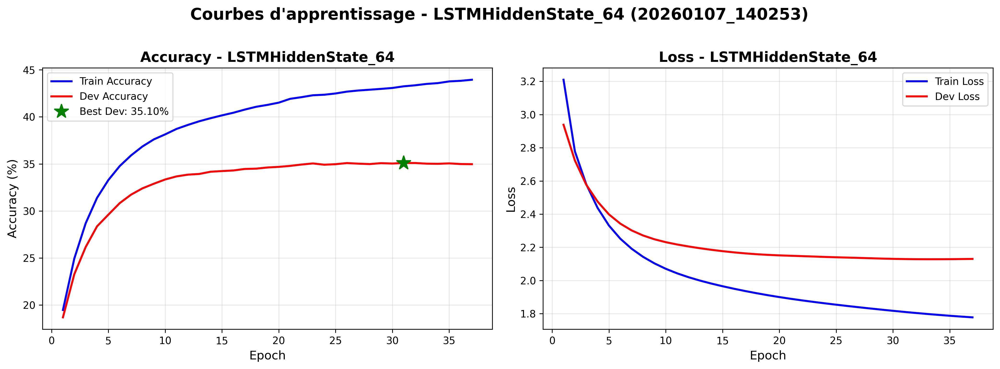

Pour améliorer ça, je vais réentrainer le model LSTM optimisé avec plus de dropout (0.1 et 0.2) et moins d'epochs (20).

Pour ce modèle, on a 41536 paramètres entraînables.

- Dropout = 0.1
**Logs:**

Recalculing the best DEV: WAcc : 35.42666666666667%
Fin entrainement LSTMHiddenState_Dropout_64 sur 20 epoch en (179.8138403892517, 'sc') | Paramètres: Learning rate= 0.005 - Optimizer= Adam - Dropout= 0.1

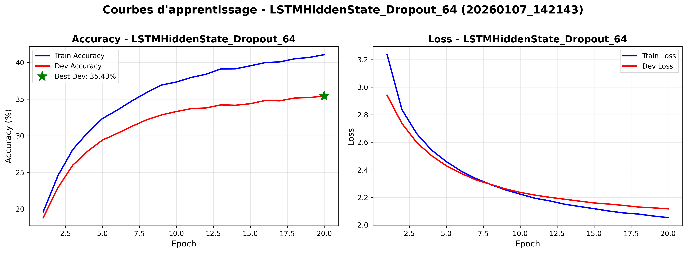

- Dropout = 0.2
**Logs:**

Recalculing the best DEV: WAcc : 34.026666666666664%
Fin entrainement LSTMHiddenState_Dropout_64 sur 20 epoch en (180.72124028205872, 'sc') | Paramètres: Learning rate= 0.005 - Optimizer= Adam - Dropout= 0.2

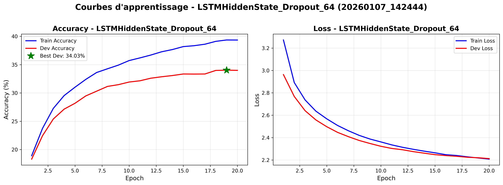


On peut voir que grâce à l'ajout du dropout, la différence de loss entre train et dev s'est réduite ce qui indique une réduction de l'overfitting. En ajoutant une fonction d'activation comme ReLU ou tanh, on pourrait peut-être encore réduire l'overfitting.

- Dropout = 0.1 + ReLU
**Logs:**

Recalculing the best DEV: WAcc : 31.169999999999998%
Fin entrainement LSTMHiddenState_Dropout_Relu_64 sur 20 epoch en (242.9840669631958, 'sc') | Paramètres: Learning rate= 0.005 - Optimizer= Adam - Dropout= 0.1


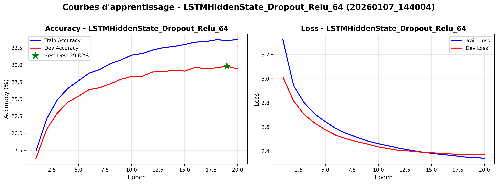

- Dropout = 0.2 + ReLU
**Logs:**

Recalculing the best DEV: WAcc : 29.823333333333334%
Fin entrainement LSTMHiddenState_Dropout_Relu_64 sur 20 epoch en (248.544508934021, 'sc') | Paramètres: Learning rate= 0.005 - Optimizer= Adam - Dropout= 0.2


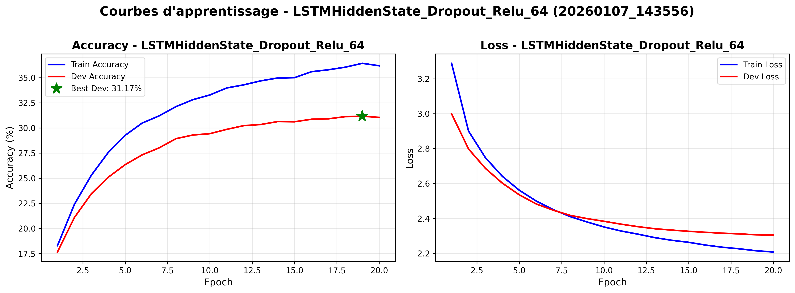

- Dropout = 0.1 + tanh
**Logs:**

Recalculing the best DEV: WAcc : 34.94%
Fin entrainement LSTMHiddenState_Dropout_Tanh_64 sur 20 epoch en (246.82054924964905, 'sc') | Paramètres: Learning rate= 0.005 - Optimizer= Adam - Dropout= 0.1


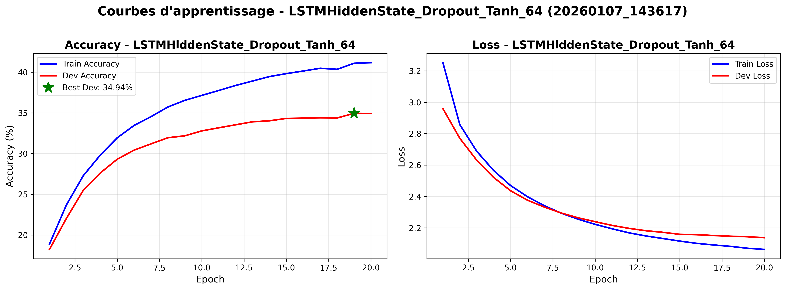

- Dropout = 0.2 + tanh
**Logs:**

Recalculing the best DEV: WAcc : 34.35%
Fin entrainement LSTMHiddenState_Dropout_Tanh_64 sur 20 epoch en (243.60504722595215, 'sc') | Paramètres: Learning rate= 0.005 - Optimizer= Adam - Dropout= 0.2


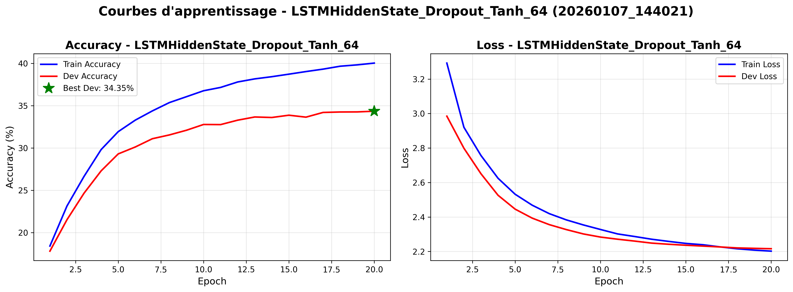

Plus tôt j'avais retiré la partie "softmax" à la fin du modèle LSTM, je vais la remettre pour voir si ça améliore les performances.

- Dropout = 0.1 + Relu + softmax
**Logs:**

Recalculing the best DEV: WAcc : 19.666666666666664%
Fin entrainement LSTMHiddenState_Dropout_Relu_Softmax_64 sur 20 epoch en (266.0434787273407, 'sc') | Paramètres: Learning rate= 0.005 - Optimizer= Adam - Dropout= 0.1


- Dropout = 0.2 + Relu + softmax
**Logs:**

Recalculing the best DEV: WAcc : 20.676666666666666%
Fin entrainement LSTMHiddenState_Dropout_Relu_Softmax_64 sur 20 epoch en (275.09586095809937, 'sc') | Paramètres: Learning rate= 0.005 - Optimizer= Adam - Dropout= 0.2


- Dropout = 0.1 + Tanh + softmax
**Logs:**

Recalculing the best DEV: WAcc : 22.096666666666668%
Fin entrainement LSTMHiddenState_Dropout_Tanh_Softmax_64 sur 20 epoch en (275.36101055145264, 'sc') | Paramètres: Learning rate= 0.005 - Optimizer= Adam - Dropout= 0.1


- Dropout = 0.2 + Tanh + softmax
**Logs:**

Recalculing the best DEV: WAcc : 21.51%
Fin entrainement LSTMHiddenState_Dropout_Tanh_Softmax_64 sur 20 epoch en (274, 'sc') | Paramètres: Learning rate= 0.005 - Optimizer= Adam - Dropout= 0.2


J'avais retiré le softmax pour le LSTMHiddenState. En le rajoutant, on voit que les scores diminuent.

Je vais retenter un entraînement du modèle LSTM optimisé avec un dropout de 0.2 mais sans softmax en testant plusieurs configurations de couches.

Vous trouverez les résultats du grid search dans le tableau accessible ici: http://bit.ly/3NqOaAh.

À mon avis, le modèle LSTM optimisé avec l'architecture [256] et la fonction d'activation ReLU est le meilleur compromis entre performance et temps d'entraînement. Cependant, on observe toujours une différence significative entre l'accuracy sur le train set et le dev set, ce qui suggère qu'il y a encore de l'overfitting. Pour réduire davantage l'overfitting, il serait intéressant d'explorer des techniques supplémentaires telles que la régularisation L2 ou l'augmentation des données.

J'ai tracé la courbe d'apprentissage du modèle LSTM optimisé avec l'architecture [256] et la fonction d'activation ReLU.
![Courbes d'apprentissage LSTM optimisé - Architecture [256] + ReLU](results/plots/learning_curve_LSTMHiddenState_Dropout_Relu_256_Post_Optimisation_20260108_212121.png)

On remarque qu'il y a toujours beaucoup d'overfitting. La différence entre l'accuracy sur le train set et le dev set est encore importante, ce qui indique que le modèle a du mal à généraliser aux données non vues. De plus, la loss sur le dev set stagne tandis que la loss sur le train set continue de diminuer, ce qui est un signe classique d'overfitting.

#### MLP optimisé
Comme le LSTM optimisé souffrait d'overfitting, j'ai fait la même analyse sur le MLP optimisé. Le MLP optimisé a l'air d'avoir un comportement plus stable en partie, il ne perd pas contre le modèle LSTM de base comme le LSTM optimisé.

J'ai décidé de faire un grid search sur différentes modèles de MLP pour voir si je peux améliorer ses performances. J'ai décidé, par contrainte de temps, de ne pas tester le batch size de 64 car ça augmente beaucoup trop le temps d'entraînement (ça a retiré 108 expériences à exécuter).


Vous trouverez les résultats du grid search dans le tableau accessible ici: https://bit.ly/3YDXUcZ.

Selon moi, le meilleur modèle est le MLP_512_256_Dropout_Gridsearch_Relu car il a la meilleure accuracy sur le dev set (35.84%) et une différence accuracy train-dev de 8.01% ce qui est acceptable. 

![Courbes d'apprentissage MLP optimisé - Architecture [512, 256] + ReLU](results/plots/learning_curve_MLP_512_256_Dropout_Relu_Post_Optimisation_20260108_212338.png)

On remarque que le MLP optimisé avec l'architecture [512, 256] et la fonction d'activation ReLU a un comportement plus stable que le LSTM optimisé. La différence entre l'accuracy sur le train set et le dev set est moindre, ce qui indique que le modèle généralise mieux aux données non vues. Cependant, il y a encore une certaine différence, suggérant qu'il pourrait y avoir un léger overfitting.

#### Test des modèles optimisés en partie
Les modèles ont toujours des performances en parties qui sont pas en accord avec leurs performances sur le dev set. Je pense que malgré le fait que j'ai réduit l'overfitting, il en reste encore un peu. Par exemple, le modèle LSTM optimisé et le modèle MLP optimisé ont des accuracies respectives de 36.73% et 35.84% sur le dev set, mais lors des parties jouées, ils ont gagné 50/10 parties chacun à chaque fois.

Je vais donc passer au CNN pour voir si je peux obtenir de meilleures performances et je ferais l'augmentation des données après ça.

# Conclusion de l'optimisation des modèles MLP et LSTM
Après avoir optimisé les modèles MLP et LSTM, j'ai constaté que le modèle LSTM optimisé avec l'architecture [256] et la fonction d'activation ReLU offre les meilleures performances, avec une accuracy de 36.73% sur le dev set. Cependant, il souffre encore d'overfitting, comme en témoigne la différence significative entre l'accuracy sur le train set et le dev set. Le modèle MLP optimisé avec l'architecture [512, 256] et la fonction d'activation ReLU présente également de bonnes performances, avec une accuracy de 35.84% sur le dev set, et un comportement plus stable en termes de généralisation. Cependant, les performances en parties jouées ne sont pas entièrement cohérentes avec les performances sur le dev set.

# CNN
Pour l'implémentation du CNN, j'ai créé plusieurs modèles avec différentes architectures et fonctions d'activation. J'ai effectué un grid search similaire à celui réalisé pour les modèles MLP et LSTM, en testant diverses combinaisons de couches convolutives, de dropout, et de fonctions d'activation (ReLU, Tanh).

Vous trouverez les résultats du grid search dans le tableau accessible ici: https://bit.ly/4aXhwjA.

D'après ma compréhension du kernel size et du padding pour un CNN, j'ai décidé de garderle kernel size en 3x3, car il permet de bien capturer les spécificités du jeu et j'ai aussi choisi de mettre 1 de padding pour conserver une matrice 8x8 en sortie de chaque couche.

D'après les résultats obtenus, je vais conserver deux modèles de CNN pour faire de l'optimisation dessus:

CNN_64_128_256_Dropout_Gridsearch_Relu (43.87% accuracy sur dev set en 5 epochs)
![Courbes d'apprentissage CNN optimisé - Architecture [64, 128, 256] + ReLU](results/plots/learning_curve_CNN_64_128_256_Dropout_Gridsearch_Relu_20260109_200709.png)
Paramètres:
- Learning rate= 0.001
- Optimizer= Adam
- Dropout= 0.2
- Batch size= 128
- Nombre de paramètres entraînables= 1418304
- Temps d'entraînement= 389sc

CNN_32_64_128_Dropout_Gridsearch_Relu (44.15% accuracy sur dev set en 10 epochs)
![Courbes d'apprentissage CNN optimisé - Architecture [32, 64, 128] + ReLU](results/plots/learning_curve_CNN_32_64_128_Dropout_Gridsearch_Relu_20260109_045319.png)
Paramètres:
- Learning rate= 0.001
- Optimizer= Adam
- Dropout= 0.2
- Batch size= 64
- Nombre de paramètres entraînables= 617024
- Temps d'entraînement= 1081sc

Pour ces deux modèles, on peut remarquer qu'on a énormément d'overfitting car la courbe de loss de dev croit alors que celle de train diminue (Modèle 1: 22.76%, Modèle 2: 24.68%). Il y a aussi une énorme différence entre l'accuracy sur le train set et le dev set (Modèle 1: 31.72%, Modèle 2: 37.75%). Le score est très bon sur le dev set mais la complexité des modèles fait qu'ils ont du mal à généraliser sur si peu de données. Je vais retenter l'expérience avec l'augmentation des données. Voir section [CNN optimisé avec données augmentées](#cnn-optimisé-avec-données-augmentées).

# Augmentation des données

## Transformations
Pour augmenter les données, j'ai modifié les classes de Dataset dans data.py pour faire des opérations simples sur les parties à leur chargement:
- Rotations (90, 180, 270 degrés)
- Symétrie
Le dataset a été démultiplié grâce à ces transformations (il y a actuellement 1440240 samples dans le train set contre 180030 avant augmentation).

J'ai donc réentraîné les modèles optimisés LSTM et MLP avec ce nouveau dataset augmenté.

### LSTM optimisé avec données augmentées
**Logs:**

Recalculing the best DEV: WAcc : 45.63458333333333%
Fin entrainement LSTMHiddenState_Dropout_Relu_256_Post_Optimisation_DataAugmentation_20epochs sur 20 epoch en (1677.0660762786865, 'sc') | Paramètres: Learning rate= 0.005 - Optimizer= Adam - Dropout= 0.3


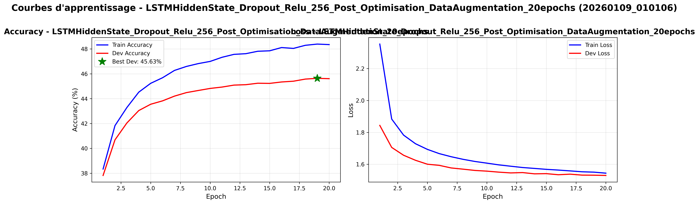

En analysant la courbe d'apprentissage du LSTM optimisé avec les données augmentées, on peut observer que l'accuracy sur le dev set a considérablement augmenté pour atteindre 45.63%, ce qui est une amélioration significative par rapport à l'entraînement précédent sans augmentation des données (36.73%). De plus, l'overfitting semble avoir été réduit, car la différence entre l'accuracy sur le train set et le dev set est moindre (~6%). Cependant, le temps d'entraînement a également augmenté de manière significative (1677sc contre 542sc avant augmentation des données).

On peut remarquer que la loss sur dev et sur train sont très proches (1.3% d'écart), ce qui indique que le modèle généralise bien.

Vu le gain en performance général, cela semble être un compromis acceptable. Je vais sauvegarder ce modèle et le faire jouer des parties contre le MLP optimisé avec données augmentées (Nom du modèle: **save_models_LSTMHiddenState_Dropout_Relu_256_Post_Optimisation_DataAugmentation_20epochs/model_19_1767916779.1295853_0.45634583333333334prct**).

### MLP optimisé avec données augmentées
**Logs:**

Recalculing the best DEV: WAcc : 38.403333333333336%
Fin entrainement MLP_512_256_Dropout_Relu_Post_Optimisation sur 20 epoch en (3188.7968485355377, 'sc') | Paramètres: Learning rate= 0.001 - Optimizer= Adam - Dropout= 0.3


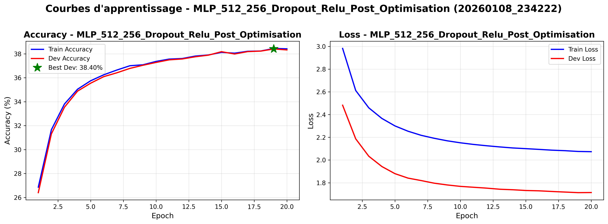

Grâce à la courbe d'apprentissage, on peut remarquer que l'overfitting est quasiment nul sur cet entrainement avec un très bon score de 38% par rapport à avant.
Cependant, le temps d'entraînement a énormément augmenté (3188sc contre 709sc avant augmentation des données). Mais vu le gain en précision, c'est plutôt correct.

Comme j'ai remarqué que la courbe n'avait pas terminé de monter, j'ai décidé de lancer l'entrainement avec plus d'epochs (50):
**Logs:**

Recalculing the best DEV: WAcc : 46.385%
Fin entrainement MLP_512_256_Dropout_Relu_Post_Optimisation_DataAugmentation_50epochs sur 50 epoch en (4120.490372419357, 'sc') | Paramètres: Learning rate= 0.001 - Optimizer= Adam - Dropout= 0.1


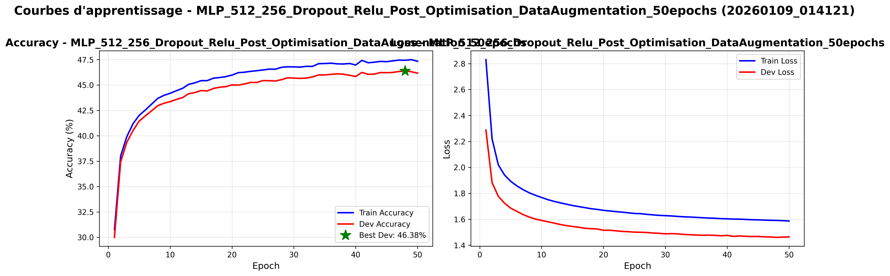

Dans ce graphique, on voit que l'accuracy sur le dev set a continué d'augmenter pour atteindre 46.38% après 50 epochs, ce qui est une amélioration significative par rapport aux entraînements précédents. De plus, l'overfitting reste très faible, indiquant que le modèle généralise plutôt bien. Lors ce cet entrainement, le temps d'entraînement a encore augmenté (4120sc contre 3188sc pour 20 epochs), mais le gain en performance semble justifier ce coût supplémentaire. De plus, on peut remarquer que l'overfitting a fortement diminué par rapport à l'entrainement avec 20 epochs (9% d'écart entre train et dev contre 21% avant). Je vais donc garder ce modèle MLP optimisé avec données augmentées (Nom du modèle: **save_models_MLP_512_256_Dropout_Relu_Post_Optimisation_DataAugmentation_50epochs/model_48_1767919116.7898524_0.46385prct**) pour le faire jouer des parties contre le LSTM optimisé avec données augmentées.

### CNN optimisé avec données augmentées
J'ai fait l'entrainement des deux modèles CNN optimisés avec les données augmentées par transformation sur 20 epochs chacun. Il y a eu un énorme gain de performance sur les deux modèles, malgré un temps d'entraînement très élevé dû à la taille du dataset (1440240 samples) et un overfitting toujours présent.

Modèle 1: CNN_64_128_256_Dropout_Gridsearch_Relu
**Logs:**

Recalculing the best DEV: WAcc : 52.22458333333333%
Fin entrainement CNN_64_128_256_Dropout_Gridsearch_Relu_Optimisation_DataAugmentation_20epochs sur 20 epoch en (2260.858628511429, 'sc') | Paramètres: Learning rate= 0.001 - Optimizer= Adam - Dropout= 0.2


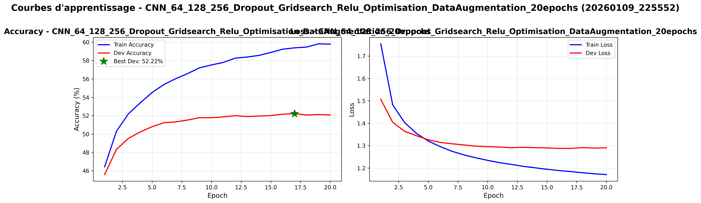

Pour ce modèle, on voit sur la courbe de loss que l'overfitting est arrivé très tôt, aux alentours de 4 epochs. La loss sur dev stagne alors que celle sur train diminue fortement. De plus, si on regarde la courbe d'accuracy, celle de dev stagne aux alentours de 52% vers 10 epochs alors que celle de train augmente jusqu'à environ 60%.


Modèle 2: CNN_32_64_128_Dropout_Gridsearch_Relu
**Logs:**

Recalculing the best DEV: WAcc : 51.65333333333333%
Fin entrainement CNN_32_64_128_Dropout_Gridsearch_Relu_Optimisation_DataAugmentation_20epochs sur 20 epoch en (2199.1251327991486, 'sc') | Paramètres: Learning rate= 0.001 - Optimizer= Adam - Dropout= 0.2


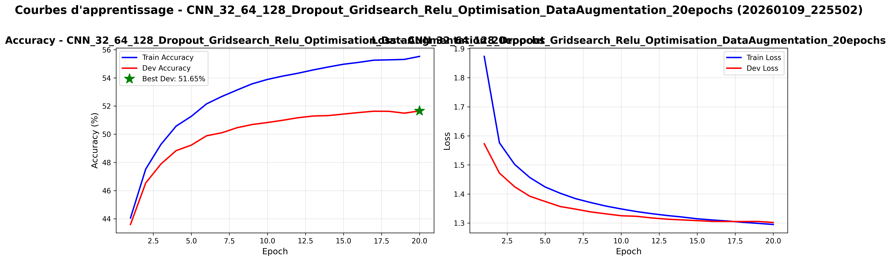

Pour ce modèle, on observe une convergence de la loss sur les deux sets après 18 epochs, ce qui indique une très bonne généralisation de la part de ce modèle. En plus, elle est très basse (~1.3), donc c'est des résultats très encourangants. Pour la courbe d'accuracy, on voit que l'accuracy sur le dev set atteint environ 51.65%, ce qui est un bon score. Cependant, il y a une différence notable entre l'accuracy sur le train set (environ 60%) et le dev set, suggérant un léger overfitting. Je vais garder ce modèle CNN optimisé et l'entraîner avec les données créées par confrontation entre modèles (voir section [Génération de parties](#génération-de-parties)) pour voir si je peux encore améliorer ses performances (modèle nommé **save_models_CNN_32_64_128_Dropout_Gridsearch_Relu_Optimisation_DataAugmentation_20epochs/model_20_1767995697.4717474_0.5165333333333333prct.pt**).

Pour augmenter les données disponibles, je vais passer par l'implémentation de la confrontation entre deux modèles. En faisant jouer deux modèles l'un contre l'autre, on peut générer de nouvelles parties qui pourront être utilisées pour entraîner les modèles.

## Utilisation de toutes les données et non pas seulement les parties gagnées

Pendant le développement de la génération de parties par deux IA, j'ai rencontré un problème de nombre de mouvements/plateaux dans le fichier h5 qui était potentiellement inférieur à 60 (certains fichiers avaient 58 ou 59 mouvements/plateaux). Après analyse, j'ai remarqué que certaines parties se terminaient avant d'atteindre 60 mouvements, car un joueur ne pouvait plus jouer (aucun coup légal disponible). Pour résoudre ce problème, j'ai d'abord réalisé la modification pour utiliser toutes les parties dans le dataset et non pas que celles qui ont 60 coups.

Pour ce faire, j'ai fait les modifications suivantes dans data.py:
- Retrait des boucles avec des valeurs fixes (30), de façon à lire la taille de la partie dynamiquement.
- Le joueur courant est déterminé en à l'aide de la parité du coup en cours.

## Génération de parties

J'ai d'abord fait un script pour déterminer le contenu d'un fichier .h5 et voir ce qu'il faut mettre dedans. 
D'après ce que j'ai compris, on a une liste de coups joués, la liste des plateaux et une clé dans le fichier h5, je vais essayer de faire la même chose en partant du fichier game.py.

Pour ce faire, j'ai copié le fichier game.py dans un nouveau fichier generate_h5_files.py que j'ai modifié. J'ai choisi un model que j'ai défini en haut du fichier pour les deux joueurs. Pendant la boucle de jeu de la partie, je mets dans des listes les mouvements et les plateaux. À la fin de la partie, j'enregistre ces listes dans un fichier h5 et dans un fichier json pour faire du debug.

J'ai généré 2000 parties en faisant s'affronter les modèles CNN optimisés et MLP optimisés (mes deux meilleurs modèles) avec données augmentées en environ 582 secondes.

### Entrainement avec les nouvelles données
Après avoir généré 2000 fichiers h5 avec des parties jouées entre différents modèles optimisés, j'ai réentraîné le modèle MLP optimisé (MLP_512_256_Dropout_Relu_Post_Optimisation_DataAugmentation_50epochs_Generation_Data) avec ces nouvelles données en plus des données augmentées par transformation.

Pour tester et pour économiser du temps de calcul, je vais regarder uniquement sur 1 epoch, puis après j'entraînerai un modèle complet sur 20 epochs avec les nouvelles données.

#### Entrainement avec uniquement les données générées par IA + transformations
**Logs:**

Number of samples (with augmentation): 96000
Development Dataste ... 
1000it [00:05, 185.00it/s]
Number of samples (with augmentation): 480000
MLP_512_256_Dropout_Relu_Post_Optimisation_DataAugmentation_50epochs_Generation_Data(
  (lin1): Linear(in_features=64, out_features=512, bias=True)
  (lin2): Linear(in_features=512, out_features=256, bias=True)
  (lin3): Linear(in_features=256, out_features=64, bias=True)
  (dropout): Dropout(p=0.2, inplace=False)
)
Number of parameters: 181056
epoch : 1/50 - loss = 2.671904208334939
Accuracy Train:40.98%, Dev:0.33% ; Time:219 (last_train:155, last_pred:63)
*************** The best score on DEV 1 :0.332%


J'ai utilisé un modèle MLP optimisé pour tester ce dataset. Cependant, j'ai remarqué que l'entrainement donne des résultats vraiment très décevants, 46% d'accuracy sur train et 0.33% sur dev set dès la première epoch. J'ai tendance à me dire que le dataset généré est uniquement composé de données générées via IA donc peu représentatives des vraies parties jouées par des humains. Je vais donc ré-entraîner le modèle MLP optimisé avec les données originales + données augmentées par transformation + données générées par IA.

#### Entrainement avec données originales + données augmentées par transformation + données générées par IA

**Logs:**

Number of samples (with augmentation): 2976480
Development Dataste ... 
1000it [00:05, 190.95it/s]
Number of samples (with augmentation): 480000
MLP_512_256_Dropout_Relu_Post_Optimisation_DataAugmentation_50epochs_Generation_Data(
  (lin1): Linear(in_features=64, out_features=512, bias=True)
  (lin2): Linear(in_features=512, out_features=256, bias=True)
  (lin3): Linear(in_features=256, out_features=64, bias=True)
  (dropout): Dropout(p=0.2, inplace=False)
)
Number of parameters: 181056
epoch : 1/50 - loss = 2.903349407895684
Accuracy Train:29.25%, Dev:29.89% ; Time:122 (last_train:72, last_pred:50)
*************** The best score on DEV 1 :29.886%


En utilisant les données originales en plus des données générées, le tout augmenté par transformation, on peut voir que le score de précision sur dev est beaucoup mieux. On voit aussi qu'on a maintenant quasiment 3000000 samples dans le jeu d'entrainement.

### Réentrainement des modèles optimisés avec les nouvelles données

Pour les entrainements suivants, j'utiliserai les modèles optimisés (MLP, LSTM, CNN), sur 20 epochs, early stopping de 5 et avec des batch size de 1000. 

#### MLP
Ce modèle a 181056 paramètres entraînables.

**Logs:**

Recalculing the best DEV: WAcc : 43.40541666666667%
Fin entrainement MLP_512_256_Dropout_Relu_Post_Optimisation_DataAugmentation_20epochs_Generation_Data sur 20 epoch en (3119.7436101436615, 'sc') | Paramètres: Learning rate= 0.001 - Optimizer= Adam - Dropout= 0.2


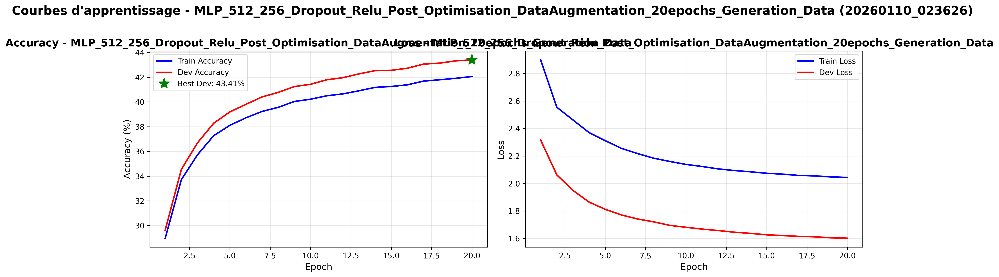

Les résultats du MLP optimisé sont bons, cependant on remarque que la courbe d'accuracy dev est largement au dessus de la courbe d'accuracy train, ce qui peu indiquer que le modèle n'a pas assez de complexité pour capturer toute la complexité du jeu. On a un temps d'entraînement très élevé (3119sc contre 4120sc avant l'ajout des données générées par IA) mais le gain en performance est conséquent.

#### LSTM
Ce modèle a 362560 paramètres entraînables.

**Logs:**

Recalculing the best DEV: WAcc : 49.425000000000004%
Fin entrainement LSTMHiddenState_Dropout_Relu_256_Post_Optimisation_DataAugmentation_20epochs_Generation_Data sur 20 epoch en (2960.11762547493, 'sc') | Paramètres: Learning rate= 0.005 - Optimizer= Adam - Dropout= 0.2


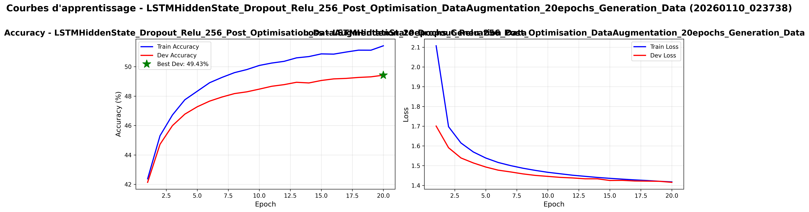

Le modèle LSTM optimisé atteint 49.42% d'accuracy sur le dev set, ce qui est un très bon score. On peut remarquer qu'il y a un plateau sur l'accuracy du dev set, qui pourrait encore une fois, indiquer que le modèle est trop "simple" pour ce dataset augmenté. Grâce aux courbes de loss, on peut voir que l'overfitting a disparu.

#### CNN
Ce modèle a 617024 paramètres entraînables.

**Logs:**

Recalculing the best DEV: WAcc : 52.07020833333333%
Fin entrainement CNN_32_64_128_Dropout_Gridsearch_Relu_Optimisation_DataAugmentation_20epochs_Generation_Data sur 20 epoch en (3294.52676320076, 'sc') | Paramètres: Learning rate= 0.001 - Optimizer= Adam - Dropout= 0.2


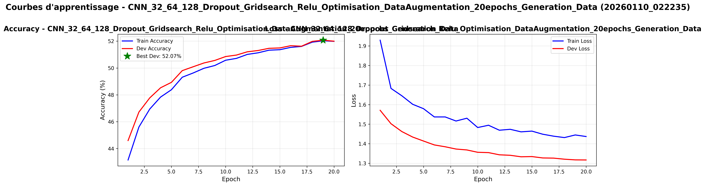

Les résultats sont excellents, il n'y a pas d'overfitting et on atteint une accuracy de 52.07% sur le dev set. Le temps d'entraînement est très élevé (3294sc contre 2199sc avant l'ajout des données générées par IA) mais le gain en performance est là. On a une courbe d'accuracy du dev set qui est au dessus de la courbe d'accuracy du train set, ce qui est un très bon signe de généralisation. Cependant, l'entrainement a atteint un plateau à 52%, tout en étant pas overfit, ce qui peut indiquer que le modèle a atteint sa limite de performance avec sa complexité actuelle.

#### Conclusion et pistes d'amélioration

Augmenter le dataset a permis d'améliorer énormément les performances des modèles. Cependant, il reste encore des pistes d'amélioration:
- Augmenter la complexité des modèles (plus de couches, plus de neurones)
- Tester d'autres architectures de modèles (CNN + LSTM, Transformer)

Augmenter la complexité des modèles va augmenter le temps d'entraînement, mais cela pourrait permettre d'atteindre de meilleures performances.

Pour la suite je vais me concentrer uniquement sur le modèle CNN qui est plus adapté pour ce type de données (images/plateaux) et qui offre de meilleures performances que les autres modèles.

### Augmentation de la complexité des modèles
#### CNN
L'entraînement sera fait sur 200 epochs avec early stopping de 10 epochs et un batch size de 1000 pour voir si augmenter la complexité permet de réduire le plateau de performance.

Pour le CNN, je vais passer créer un nouveau CNN avec comme configuration:
- Couches convolutives: [32, 64, 128, 256]
- Dropout: 0.2
- Fonction d'activation: ReLU
- Learning rate: 0.001
- Optimizer: Adam
- Batch size: 1000

Le modèle passe à 1436480 paramètres entraînables pour un dataset de 2.9 millions de samples.

**Logs:**

Recalculing the best DEV: WAcc : 55.23875%
Fin entrainement CNN_32_64_128_256_Dropout_Gridsearch_Relu_Optimisation_DataAugmentation_200epochs_Generation_Data sur 50 epoch en (10932.816554307938, 'sc') | Paramètres: Learning rate= 0.001 - Optimizer= Adam - Dropout= 0.2

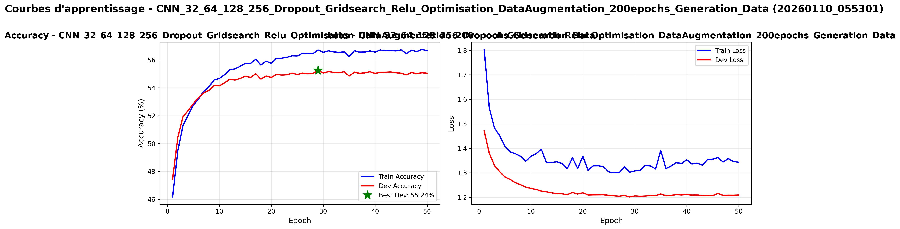

Sur ce modèle, on peut remarquer qu'on a toujours un plateau sur l'accuracy de dev qui début à la 10ème epoch. On a un gain de performances concret par rapport au modèle précédent, mais le temps d'entrainement a énormément augmenté (10932sc contre 3294sc avant). On peut aussi remarquer que l'overfitting est toujours absent, ce qui est un très bon point. L'entraînement sur 200 epochs était pour voir jusqu'où le modèle irait, mais il s'est arrêté à la 50ème epoch à cause de l'early stopping, donc les prochains essais se feront sur maximum 50 epochs.
Je vais conserver ce modèle car il offre de bons résultats.

##### Variation du learning rate
Je vais aussi essayer de briser le plateau en faisant varier le learning rate pendant l'entraînement. Je vais commencer avec un learning rate de 0.001 qui sera divisé par deux en cas de valeur ne changeant pas pendant après 2 epochs.

**Logs:**

Recalculing the best DEV: WAcc : 56.90020833333334%
Fin entrainement CNN_32_64_128_256_Dropout_Gridsearch_Relu_Optimisation_DataAugmentation_200epochs_Generation_Data_Scheduler sur 200 epoch en (15951.312160253525, 'sc') | Paramètres: Learning rate= 0.001 - Optimizer= Adam - Dropout= 0.2 - Batch Size= 1000 <torch.optim.lr_scheduler.ReduceLROnPlateau object at 0x0000024147563CB0>
best_epoch: 61


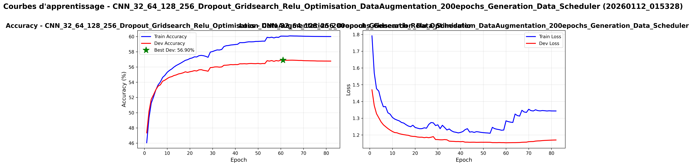

##### Ajout de complexité supplémentaire

Je vais aussi tester un modèle plus complexe configuré comme suit pour voir si augmenter encore la complexité améliore les performances ou les dégrades:
- Couches convolutives: [64, 128, 256, 512, 1024]
- Dropout: 0.2
- Fonction d'activation: ReLU
- Learning rate: 0.001
- Optimizer: Adam
- Batch size: 1000

Le modèle passe à 10463808 paramètres entraînables pour un dataset de 2.9 millions de samples.

**Logs:**

Recalculing the best DEV: WAcc : 56.335416666666674%
Fin entrainement CNN_64_128_256_512_1024_Dropout_Gridsearch_Relu_Optimisation_DataAugmentation_200epochs_Generation_Data sur 28 epoch en (11247.05422949791, 'sc') | Paramètres: Learning rate= 0.001 - Optimizer= Adam - Dropout= 0.2


Sur celui-ci, la complexité est peut-être trop élevée car on remarque un gros overfitting qui commence à la 3ème epoch. À partir de la 7ème epoch, la loss sur dev set augmente alors que celle sur train diminue fortement. Le temps d'entraînement a encore augmenté (11247sc contre 10932sc avant) mais le gain en performance est minime (56.33% contre 55.23% avant). Je pense que la complexité de ce modèle est trop élevée pour le dataset utilisé, ce qui entraîne de l'overfitting et limite les performances. De plus, l'entraînement s'est arrêté à la 28ème epoch à cause de l'early stopping, donc je ne vais pas retenir ce modèle pour la suite.

##### Variation du learning rate sur le modèle très complexe
Je vais aussi tester la variation du learning rate sur ce modèle très complexe pour voir si ça améliore les performances.

**Logs:**

Recalculing the best DEV: WAcc : 0.5788270833333333%
Fin entrainement CNN_64_128_256_512_1024_Dropout_Gridsearch_Relu_Optimisation_DataAugmentation_200epochs_Generation_Data_Scheduler sur 200 epoch en (21691.37, 'sc') | Paramètres: Learning rate= 0.001 - Optimizer= Adam - Dropout= 0.2 - Batch Size= 1000
best epoch: 45


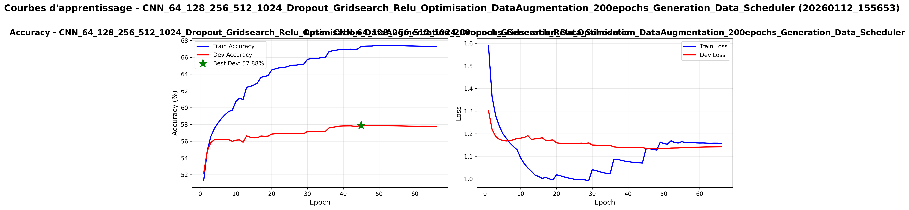

Sur cette courbe on peut voir que le modèle a énormément overfitté dès les premières epochs. C'est peut-être dû au fait que mon modèle de données est composé de trop de données similaires (données augmentées par transformation + données générées par IA). Le temps d'entraînement a énormément augmenté (21691sc contre 11247sc avant) mais le gain en performance est nul (57.88% contre 56.33% avant). Je ne vais pas retenir ce modèle pour la suite.

#### Batch normalization
Pour améliorer encore mon modèle de CNN, j'ai vu qu'il existe une technique appelée batch normalization qui permet de retarder la convergeance du modèle et qui permet de se passer de dropout. Pour ça j'utilise la classe `nn.BatchNorm2d` de PyTorch que j'insère après chaque couche convolutive. Cela va rendre les données en sortie d'une couche convolutive comprises entre 0 et 1, ce qui évite d'avoir des données trop grandes ou trop petites qui pourraient ralentir l'apprentissage.

Je vais faire le test avec le modèle suivant:
- Couches convolutives: [32, 64, 128, 256]
- Batch normalization après chaque couche convolutive
- Pas de dropout
- Fonction d'activation: ReLU
- Learning rate: 0.001
- Optimizer: Adam
- Batch size: 1000

On se retrouve avec 389057 paramètres entraînables pour un dataset de 2.9 millions de samples.

**Logs:**

Recalculing the best DEV: WAcc : 53.03604166666667%
n entrainement CNN_32_64_128_256_Relu_Optimisation_DataAugmentation_50epochs_Generation_Data_Batch_Norm sur 34 epoch en (5526.1315586566925, 'sc') | Paramètres: Learning rate= 0.001 - Optimizer= Adam - Dropout= 0.2 - Batch Size= 1000
best_epoch: 23


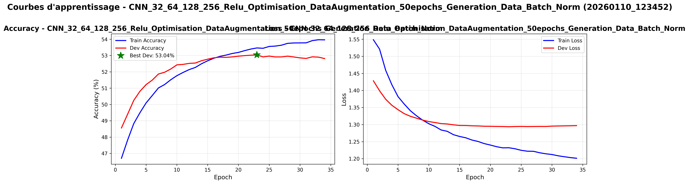

En regardant les courbes, on voit qu'à partir de 5/10 epochs le modèle commence à stagner et donc l'accuracy sur le dev set n'augmente plus et la loss sur dev ne baisse plus. Cela nous indique que le modèle a "terminé d'apprendre" et qu'on a atteint les limites de ses capacités. La complexité du modèle est encore insuffisante pour capturer toute la complexité du jeu, malgré l'utilisation de la batch normalization. Le temps d'entraînement est plus faible que les autres modèles (5526sc contre 10932sc pour le modèle sans batch norm) mais le score est aussi plus faible (53.03% contre 55.23% pour le modèle sans batch norm). Je vais essayer de doubler les neurones à chaque couche pour voir si ça améliore les performances.

Je vais faire le test avec le modèle suivant:
- Couches convolutives: [64, 128, 256, 512]
- Batch normalization après chaque couche convolutive
- Pas de dropout
- Fonction d'activation: ReLU
- Learning rate: 0.001
- Optimizer: Adam
- Batch size: 1000

On se retrouve avec 1552257 paramètres entraînables pour un dataset de 2.9 millions de samples.

**Logs:**

Recalculing the best DEV: WAcc : 53.13708333333334%
Fin entrainement CNN_64_128_256_512_Relu_Optimisation_DataAugmentation_50epochs_Generation_Data_Batch_Norm sur 21 epoch en (6178.024012804031, 'sc') | Paramètres: Learning rate= 0.001 - Optimizer= Adam - Dropout= 0.2 - Batch Size= 1000
best_epoch: 11


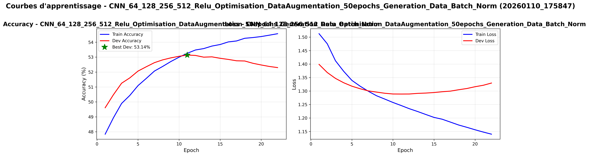

Suite à cette expérience, on peut voir qu'augmenter la complexité du modèle n'a pas donné de gain de performance mais plutôt une dégrédation de celles-ci (53.14% contre 55.24% pour le CNN_32_64_128_256_Dropout_Gridsearch_Relu_Optimisation_DataAugmentation_200epochs_Generation_Data). De plus, le temps d'entraînement a énormément augmenté (6178sc contre 5526sc avant). On remarque aussi que l'overfitting est très présent, ce qui fait que ce modèle n'est pas pertinent pour la suite.

#### Conclusion sur les CNN
Après avoir testé plusieurs architectures de CNN, j'ai pu constater que le modèle CNN_32_64_128_256_Dropout_Gridsearch_Relu_Optimisation_DataAugmentation_200epochs_Generation_Data offre les meilleures performances avec un bon compromis entre complexité, temps d'entraînement et précision. Les autres modèles plus complexes ont tendance à overfitter ou n'apportent pas de gain significatif en performance.
On peut noter quand même que le scheduler de learning rate a permis d'atteindre un score de 56.90% sur le dev set, ce qui est une amélioration notable.
Je vais donc conserver ce modèle pour la suite et essayer d'autres architectures de modèles pour voir si je peux encore améliorer les performances.

# CNN-LSTM
Le modèle CNN-LSTM combine les avantages des CNN pour comprendre les caractéristiques du plateau et du LSTM pour la mémoire des coups joués. À priori, ce modèle devrait offrir de meilleures performances que les modèles précédents.

## Essai 1
Pour ce modèle, j'ai décidé de repartir du modèle CNN optimisé gardé plus haut (même paramètres) et d'ajouter une couche LSTM après les couches convolutives.

Voici les paramètres du modèle:
- Couches convolutives: [32, 64, 128, 256]
- Couche LSTM: 256 neurones (input_size=256, hidden_size=256, num_layers=1)
- Dropout: 0.2
- Fonction d'activation: ReLU
- Learning rate: 0.001
- Optimizer: Adam

Modèles: 
- CNN_32_64_128_256_LSTM_256_Dropout_5_History_Base_Dataset_20epochs
- CNN_32_64_128_256_LSTM_256_Dropout_5_History_Augmented_Dataset_20epochs

On a 17462080 paramètres entraînables pour un dataset de 360060 (Base) et 2.9 millions de samples (Augmenté).

Je vais d'abord entrainer le modèle sur 20 epochs sur le dataset de base pour voir si le modèle est capable d'apprendre correctement. Ensuite je passerai sur le dataset augmenté.

### Dataset original
Pour ce dataset je vais faire l'entrainement sur 20 epochs avec early stopping de 5 epochs et un batch size de 128 pour une question d'optimisation du temps d'entrainement. Vu la taille et la complexité du modèle, on peut s'attendre a beaucoup d'overfitting.
**Logs:**

Recalculing the best DEV: WAcc : 48.07666666666667%
Fin entrainement CNN_32_64_128_256_LSTM_256_Dropout_5_History_Base_Dataset_20epochs sur 12 epoch en (1347.2515943050385, 'sc') | Paramètres: Learning rate= 0.001 - Optimizer= Adam - Dropout= 0.2 - Batch Size= 128
best_epoch: 6


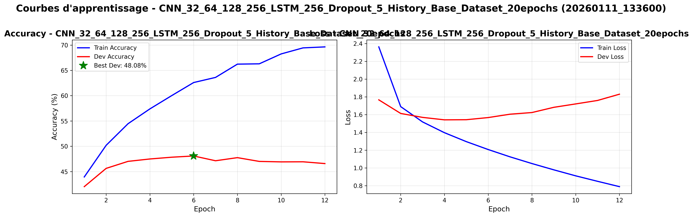

Comme prévu initialement, il y a énorémement d'overfitting (66.87% pour l'accuracy et de 131,75% pour la loss). Comme le nombre de paramètres est très élevé, le modèle a du mal à généraliser sur le dev set. Cependant, on peut voir que l'accuracy sur le dev set atteint 48.07%, ce qui est un bon score pour un premier entrainement. Je vais essayer l'entrainement sur le dataset augmenté pour voir si les performances s'améliorent.

### Dataset augmenté
Pour cet entrainement, je vais passer à un batch size de 1000 pour optimiser le temps d'entrainement. L'entrainement sera fait sur 20 epochs avec early stopping de 5 epochs.

**Logs:**

Recalculing the best DEV: WAcc : 54.5625%
Fin entrainement CNN_32_64_128_256_LSTM_256_Dropout_5_History_Augmented_Dataset_20epochs sur 12 epoch en (4988.91354060173, 'sc') | Paramètres: Learning rate= 0.001 - Optimizer= Adam - Dropout= 0.2 - Batch Size= 1000
best_epoch: 7


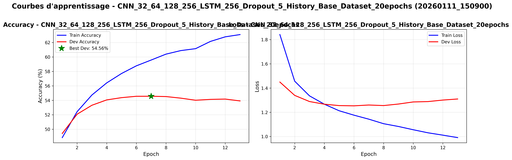

On peut voir que même si le modèle atteint un très bon score de 54.56% sur le dev set, l'overfitting est toujours très présent (environ 15% entre train et dev à la fin de l'entrainement). Le temps d'entrainement a énormément augmenté (4988sc contre 3294sc pour le CNN optimisé seul). On remarque aussi qu'on atteint un plateau sur l'accuracy et qu'à la fin de l'entrainement, la dev loss remonte. J'en conclue que le modèle overfit et apprend les données d'entrainement au lieu de généraliser. 

## Essai 2
Pour ce second essai, je vais réduire la complexité du CNN en enlevant une couche convolutive et en uniformisant le nombre de neurones dans chaque couche. Je vais aussi réduire la taille de la couche LSTM pour diminuer le nombre de paramètres et donc l'overfitting.

Le modèle sera le suivant:
- Couches convolutives: [64, 64, 64]
- Couche LSTM: 128 neurones (input_size=64, hidden_size=128, num_layers=1)
- Dropout: 0.2
- Fonction d'activation: ReLU
- Learning rate: 0.001
- Optimizer: Adam

Modèle:
- CNN_64_64_64_LSTM_128_Dropout_5_History_Base_Dataset_20epochs

On a 2246464 paramètres entraînables pour un dataset de 360060 (Base) et 2.9 millions de samples (Augmenté).

### Dataset original
Pour ce dataset je vais faire l'entrainement sur 20 epochs avec early stopping de 5 epochs et un batch size de 128 pour une question d'optimisation du temps d'entrainement.
**Logs:**

Recalculing the best DEV: WAcc : 46.58833333333333%
Fin entrainement CNN_64_64_64_LSTM_128_Dropout_5_History_Base_Dataset_20epochs sur 20 epoch en (1294.0385823249817, 'sc') | Paramètres: Learning rate= 0.001 - Optimizer= Adam - Dropout= 0.2 - Batch Size= 128
best_epoch: 8

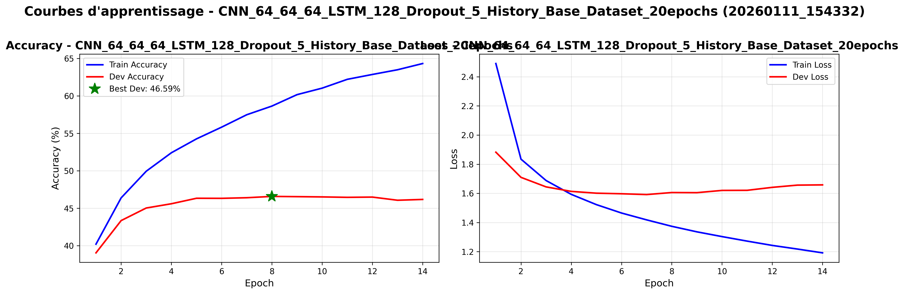

Avec cette configuration aussi on a de l'verfitting, encore plus tôt que précédemment (on atteint seulement 46%) donc uniquement réduire le nombre de convolutions et de neurones dans la couche LSTM n'est pas suffisant pour limiter l'overfitting.

## Essai 3 - Batch Normalization
Je vais faire un essai en utilisant de la normalisation par lot (batch normalization) et en réduisant le la taille de l'input de la couche LSTM pour voir si ça améliore les performances.

Le modèle sera le suivant:
- Couches convolutives: [64, 64, 64] avec batch normalization après les deux premières couches et réductions à 16 features avant la couche LSTM
- Couche LSTM: 128 neurones
- Pas de dropout
- Fonction d'activation: ReLU
- Learning rate: 0.001
- Optimizer: Adam

Modèle:
- CNN_64_64_64_LSTM_128_BatchNorm_5_History_Base_Dataset_20epochs

On a 646160 paramètres entraînables pour un dataset de 360060 (Base) et 2.9 millions de samples (Augmenté).

### Dataset original
Pour ce dataset je vais faire l'entrainement sur 20 epochs avec early stopping de 5 epochs et un batch size de 128 pour une question d'optimisation du temps d'entrainement.
**Logs:**

Recalculing the best DEV: WAcc : 47.16166666666667%
Fin entrainement CNN_64_64_64_LSTM_128_BatchNorm_5_History_Base_Dataset_20epochs sur 20 epoch en (1769.2870540618896, 'sc') | Paramètres: Learning rate= 0.001 - Optimizer= Adam - Dropout= 0.2 - Batch Size= 128
best_epoch: 12

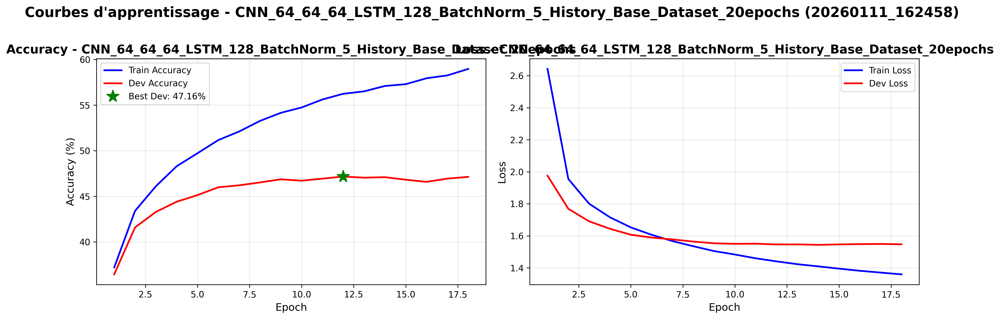

On remarque qu'avec la batch normalization, l'overfitting est réduit par rapport aux essais précédents (courbes loss). Cependant, on atteint seulement 47.16% d'accuracy sur le dev set, ce qui est en dessous des performances des modèles CNN seuls. J'ai décidé donc de modifier mon CNN_LSTM et de le transformer en CNN-LSTM incluant un résidu dans la partie CNN pour voir si ça améliore les performances.
D'après ce que j'ai compris, l'ajout d'un résidu permet de faciliter l'apprentissage en permettant au modèle de "sauter" certaines couches si elles n'apportent pas d'amélioration. Cela permet aussi de lutter contre le problème de vanishing gradient.

## Essai 4 - CNN-LSTM avec résidu
Le modèle sera le suivant:
- Couches convolutives avec résidu: [64, 64, 64] avec batch normalization après les deux premières couches et réductions à 16 features avant la couche LSTM
- Couche LSTM: 128 neurones
- Pas de dropout
- Fonction d'activation: ReLU
- Learning rate: 0.001
- Optimizer: Adam

Modèle:
- CNN_64_64_64_LSTM_Res_128_BatchNorm_5_History_Base_Dataset_20epochs

J'ai entrainé ce modèle directement sur le dataset augmenté pour voir si les performances sont bonnes.

On a 692432 paramètres entraînables pour un dataset de 2.9 millions de samples (Augmenté).

### Dataset augmenté
Pour cet entrainement, je vais passer à un batch size de 1000 pour optimiser le temps d'entrainement. L'entrainement sera fait sur 20 epochs avec early stopping de 5 epochs.

**Logs:**

Recalculing the best DEV: WAcc : 51.99%
Fin entrainement CNN_64_64_64_LSTM_Res_128_BatchNorm_5_History_Base_Dataset_20epochs sur 20 epoch en (4718.729903459549, 'sc') | Paramètres: Learning rate= 0.001 - Optimizer= Adam - Dropout= 0.2 - Batch Size= 1000  
best_epoch: 20

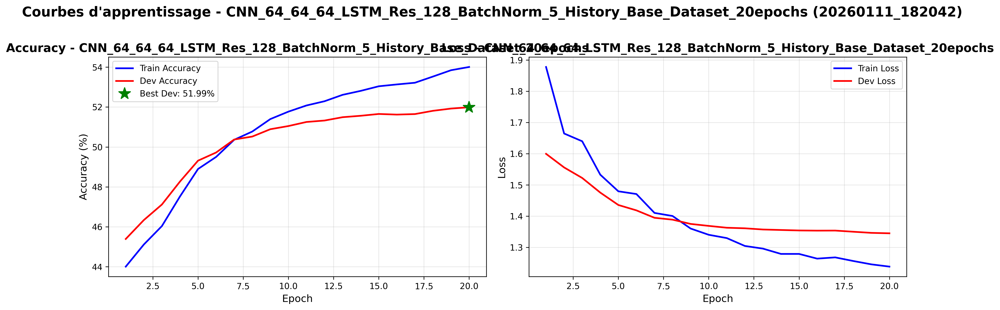

On peut voir que ce modèle apporte des résultats satisfaisants, tant au niveau accuracy/loss qu'overfitting, mais il y a quand même un plateau qui se créé à partir de la 6ème epoch, ce qui laisse entendre que le modèle a fini d'apprendre ce qu'il peut apprendre. Je pense que mon learning rate fait rater des opportunités d'apprentissage au modèle. Je vais donc faire un nouvel essai en permettant au modèle d'avoir un scheduler divisant le learning rare par 2 toutes les 2 epochs sans amélioration. Pour que le scheduler fonctionne, je vais aussi augmenter le nombre d'epochs à 50 pour laisser le temps au modèle d'apprendre. L'expérience sera faite sur le dataset de base pour économiser du temps de calcul.

## Essai 5 - CNN-LSTM avec résidu + learning rate variable
Le modèle sera le suivant:
- Couches convolutives avec résidu: [64, 64, 64] avec batch normalization après les deux premières couches et réductions à 16 features avant la couche LSTM
- Couche LSTM: 256 neurones
- Pas de dropout
- Fonction d'activation: ReLU
- Learning rate de départ: 0.1 avec scheduler (divise le lr par 2 toutes les 2 epochs sans amélioration)
- Optimizer: Adam

Modèle:
- CNN_64_64_64_LSTM_Res_128_BatchNorm_5_History_Base_Dataset_Scheduler_50epochs

On a 1497040 paramètres entraînables pour un dataset de 360060 (Base).

### Dataset original
Pour ce dataset je vais faire l'entrainement sur 50 epochs avec early stopping de 10 epochs et un batch size de 128 pour une question d'optimisation du temps d'entrainement.

**Logs:**

Recalculing the best DEV: WAcc : 45.501666666666665%
Fin entrainement CNN_64_64_64_LSTM_Res_128_BatchNorm_5_History_Base_Dataset_Scheduler_50epochs sur 19 epoch en (2083.503846645355, 'sc') | Paramètres: Learning rate= 0.001 - Optimizer= Adam - Dropout= 0.2 - Batch Size= 128
best_epoch: 8


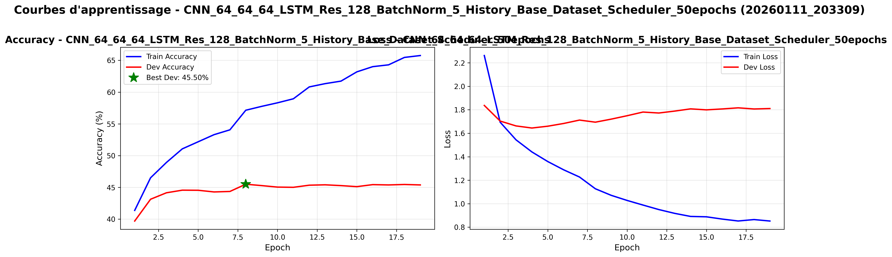

Le changement du learning rate n'a pas apporté d'amélioration significative, on atteint seulement 45.50% d'accuracy sur le dev set, ce qui est en dessous des performances des modèles CNN seuls. L'overfitting est toujours présent, mais moins prononcé que dans les essais précédents. Je pense que le modèle CNN-LSTM n'est pas adapté pour ce type de données et que les CNN seuls sont plus performants.

# Entrainement final
Pour l'entrainement final, j'ai entrainé le modèle CNN 32 64 128 256 optimisé avec données augmentées sur 50 epochs pour voir si je peux encore améliorer les performances. J'ai regroupé les données de test dans le train set augmenté pour avoir plus de données d'entraînement. J'ai aussi généré des données supplémentaires via IA pour augmenter encore le dataset. J'ai gardé les données de dev pour pouvoir mesurer les performances du modèle.

J'ai utilisé les paramètres suivants:
- Couches convolutives: [32, 64, 128, 256]
- Dropout: 0.2
- Fonction d'activation: ReLU
- Learning rate: 0.001 avec scheduler (divise le lr par 2 toutes les 2 epochs sans amélioration)
- Optimizer: Adam
- Batch size: 1000

Modèle:
- CNN_32_64_128_256_Dropout_Gridsearch_Relu_Optimisation_DataAugmentation_200epochs_Generation_Data_Scheduler_Entrainement_Final

On a 1436480 paramètres entraînables pour un dataset de 3648000 samples (Train + Test augmentés + 6000 données générées par IA).

**Logs:**

Recalculing the best DEV: WAcc : 56.732%
Fin entrainement CNN_32_64_128_256_Dropout_Gridsearch_Relu_Optimisation_DataAugmentation_200epochs_Generation_Data_Scheduler sur 30 epoch en (6945.035170316696, 'sc') | Paramètres: Learning rate= 0.001 - Optimizer= Adam - Dropout= 0.2 - Batch Size= 1000 <torch.optim.lr_scheduler.ReduceLROnPlateau object at 0x000002DC9677FE00>
best_epoch: 29

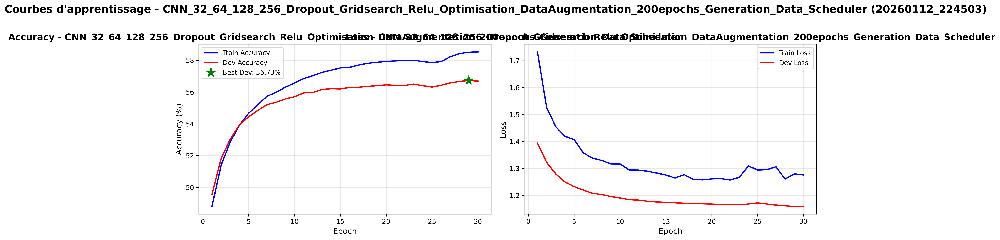

Pour ce dernier entraînement du model sur 30 epochs et avec toutes les données, j'ai pu atteindre un score de 56.73% sur le dev set, ce qui est un très bon score. On remarque que l'overfitting est très peu présent et que les courbes sont stables, ce qui indique que le modèle doit s'en sortir correctement pour généraliser ce qu'il a appris. Le temps d'entraînement est de 6945sc, ce qui est raisonnable pour la complexité du modèle et la taille du dataset.

# Tournois


J'ai organisé un tournoi avec les meilleurs modèles entraînés pour voir lequel est le plus performant en situation de jeu réel. Chaque modèle a joué 2 parties contre chaque autre modèle, en alternant les couleurs (blancs/noirs) pour chaque partie.
On peut voir que le modèle CNN optimisé avec données augmentées et données générées par IA obtenu avec l'entraînement final est le plus performant, avec un score moyen de 10 et un taux de victoire de 64.5%. Les modèles CNN optimisé avec génération de données entraîné sur 20 epochs et le modèle CNN ResNet sont aussi très performants car ils sont respectivement à 63.2 et 61.8% de taux de victoire et 9 de score moyen.

Une grande partie de mes modèles a donc vaincu les modèles fournis (Stable_Genius, Chaotic_Neutral, Convolution_Conqueror, Othello_Overlord, Random, etc...), ce qui montre qu'ils ont une certaine capacité à jouer au jeu d'Othello.
On peut remarquer aussi que ce ne sont pas les modèles ayant le plus grand nombre d'epoch d'entraînement ou encore la meilleure accuracy sur dev qui sont les gagnants. Cela peut s'expliquer par le fait que ces modèles on peut être overtfitté ou qu'ils n'ont pas appris à bien jouer au jeu d'Othello malgré une bonne accuracy sur dev set. Le LSTM a lui perdu face au Random, ce qui laisse penser que ce modèle a eu un problème lors de l'export ou de l'import du modèle dans le tournoi.

# Game.py
En faisant jouer plusieurs modèles les uns contre les autres, j'ai remarqué que les parties effectuées étaient toujours strictement les mêmes pour deux modèles données. J'ai donc modifié un peu la fonction `find_best_move` pour ajouter un peu d'aléatoire dans le choix des coups à jouer, comme dans une partie réelle.

# Utilisation GPU/CPU
Lors de l'entrainement, mon GPU est faiblement utilisé (7%). Le CPU lui a des piques à 100% mais en moyenne il est à 15%. Je pense qu'il y a un problème de lenteur au chargement des données. Quand j'augmente le batch size, le temps d'entrainement diminue mais la précision du modèle est impactée négativement. Je pense que le goulot d'étranglement vient du CPU qui n'arrive pas à fournir les données assez rapidement au GPU. En passant de LSTM/MLP à CNN, l'utilisation du GPU a augmenté à 50%, donc les modèles LSTM et MLP sont probablement trop simples pour exploiter pleinement la puissance du GPU. En faisant un CNN avec beaucoup de paramètres (plus de 10 millions), l'utilisation du GPU est montée à 90%, donc le modèle est suffisamment complexe pour exploiter pleinement le GPU.

# Conclusion
Ce projet m'a permis de découvrir plusieurs architectures de modèles de deep learning (MLP, LSTM, CNN, CNN-LSTM) et de comprendre leurs avantages et inconvénients. J'ai pu constater que les CNN sont particulièrement adaptés pour ce type de données (images/plateaux) et qu'ils offrent de meilleures performances que les autres modèles.
J'ai aussi appris l'importance de l'augmentation des données pour améliorer les performances des modèles, ainsi que l'impact de la complexité des modèles sur leur capacité à généraliser. J'ai pu expérimenter avec différentes techniques pour améliorer les performances, comme la batch normalization, le dropout, et la variation du learning rate entre autres.
Pour aller plus loin, je pourrais explorer d'autres architectures de modèles, comme les Transformers ou les modèles hybrides, ainsi que tester d'autres techniques d'augmentation des données. Je pourrais aussi essayer d'optimiser davantage le processus de chargement des données pour mieux exploiter la puissance du GPU.